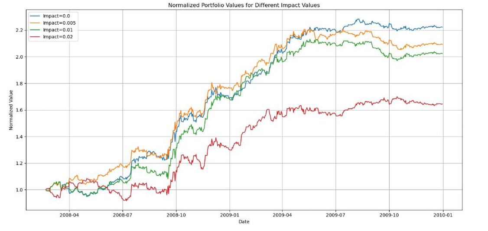
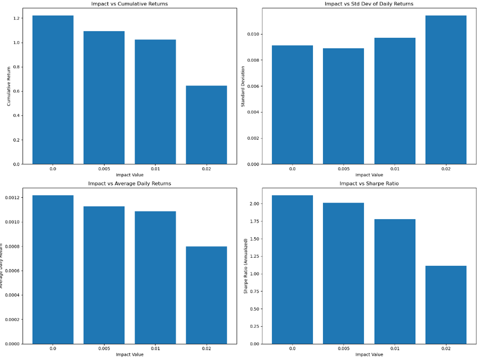
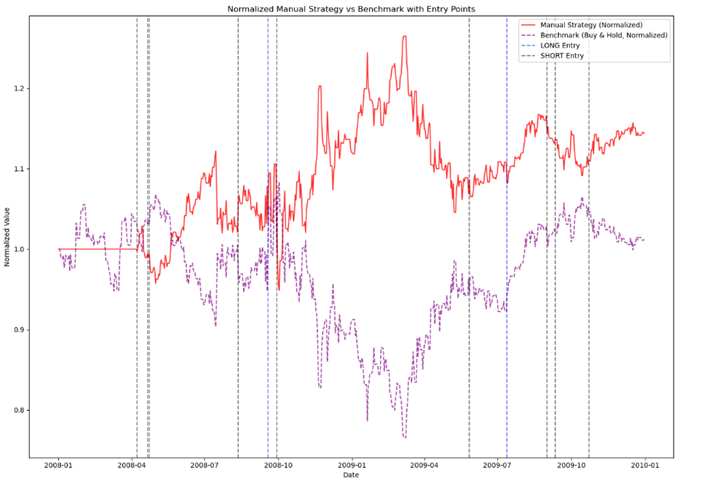
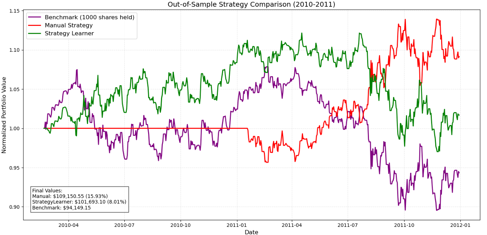

## Machine Learning for Trading – Market Simulator

This project is part of a larger system that incrementally builds an AI-based trading platform using machine learning and algorithmic trading techniques. Each component contributes to a unified trading system designed to simulate real-world decision-making and portfolio management.

In this phase, the focus is on developing a market simulator that processes trading orders, tracks portfolio value over time, and evaluates portfolio performance. This simulator serves as a foundational component for more advanced trading strategies and models implemented in later stages of the system.

---

## Project Overview

The market simulator:

- Accepts a sequence of trading orders
- Simulates trades over historical market data
- Tracks portfolio holdings and cash balance
- Calculates portfolio value over time
- Evaluates overall performance

This implementation emphasizes correctness, extensibility, and realistic modeling of trading behavior.

---

## Objectives

**Market Simulation**  
&nbsp; Design and implement a market simulator capable of handling trading orders and portfolio updates.

**Transaction Costs**  
&nbsp; Model real-world trading costs and understand their impact on portfolio performance.

---

## Demo / Visualizations

### In-sample Trading Behavior

### Impact of Values on Trading Behavior

### Comparison Between Trading Approaches

### Performance Comparison: Manual vs Benchmark Strategy

### Out-of-sample Comparison: Manual vs Q-learning Benchmark

---

## Future Extensions

This simulator is designed to integrate seamlessly with future components such as:

- Strategy learners
- Machine learning–based trading agents
- Performance analytics and optimization tools
